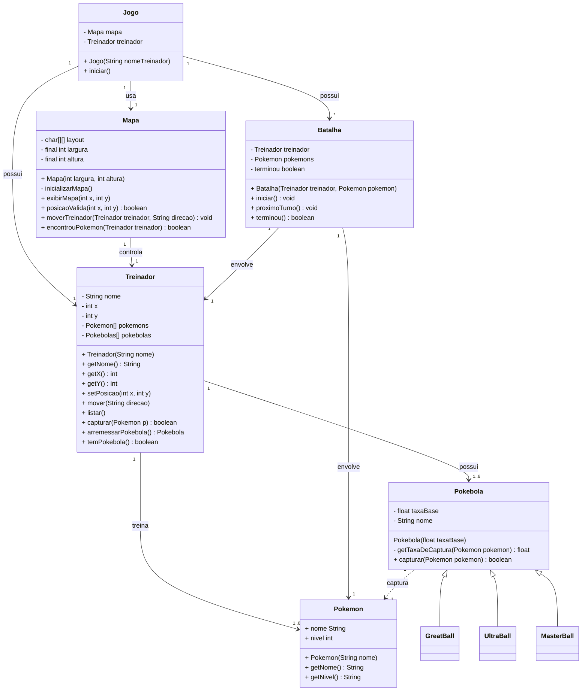
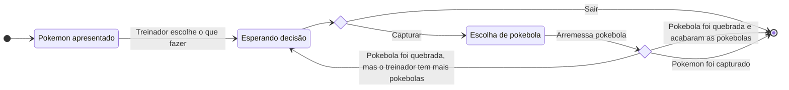

# Exercício: {{ page.title }}

## Objetivo

Implementar a funcionalidade de captura de Pokémon no jogo. A lógica de movimentação no mapa já está funcionando, e a classe Pokemon está disponível. Sua tarefa é implementar as classes relacionadas às Pokébolas, que serão usadas pelo treinador para tentar capturar os Pokémon encontrados para isso utilizaremos **Herança** já que existem diversos tipos Pokebolas.

## Descrição
 
Neste exercício você irá criar novas classes Batalha, Pokebola, GreatBall, UltraBall e MaterBall. Além disso será necessário alterar a classe Mapa.

**Mapa:**

  - Métodos: 
    - encontrouPokemon: esse deve indicicar se o treinador encontrou um pokemon a sua localização atual.
      - A cada movimento, há 50% de chance de encontrar um Pokémon.
      - No entanto, apenas em locais sinalizados com ' w ' um pokemon pode ser encontrado. 
    
**Treinador:**

  - Atributos:
    - pokebolas: Esse atributo deve armazenar as pokebolas de um treinador.
  - Métodos:
    - arremesarPokebola: Este método recuperar a pokebola que será utilizada na captura.
      - Uma pokebola só pode ser utilizada uma única vez. 
    - temPokebola: Indica se o treinador ainda tem pokebolas.
   
**Batalha:**
  
  - Essa classe controla a interação entre Treinador e Pokemon simulando uma Batalha.
  - Na versão atual, devem existir duas opções, tentar captura um pokemon ou sair.
  - Atributos:
    - Treinador: representa o treinador em batalha
    - Pokemon: representa o treinador em batalha
    - terminou: inidica se a batalha terminou
  - Métodos:
    - iniciar: Inicia a batalha mostrando as opções
    - proximoTurno: Inicia um novo turna da batalha
    - terminou: Indica que a batalha terminou  

Fluxo de uma batalha:

**Pokebola:**

- Atributos:
  - nome: Nome da Pokébola.
  - taxaBase: Taxa base de captura (entre 0.0 e 1.0).

- Métodos:
  - Construtor que inicializa os atributos.
  - getTaxaDeCaptura: para um dado pokemon, calcula a a chance de capturá-lo
    - Utilize a seguinte formula:
      - $$ taxaBase - taxaBase * \cfrac{nivelPokemon}{nivelMaximo}$$ + 0.05
  - capturar: Implementação específica para cada tipo de Pokébola.
    - Sorteia um número aleatório entre 0 e 1. Se ele for **menor** que chance o pokemon é capturado
    - Retorne `true` se a captura for bem-sucedida, `false` caso contrário.
 
 
**Classes Derivadas de Pokebola:**

 - Pokébola: Taxa base = 0.4.
 - Crie as seguintes subclasses de Pokebola:
   - Great Ball: Taxa base = 0.6.
   - Ultra Ball: Taxa base = 0.8.
   - Master Ball: Taxa base = 1, mas sempre caputra

