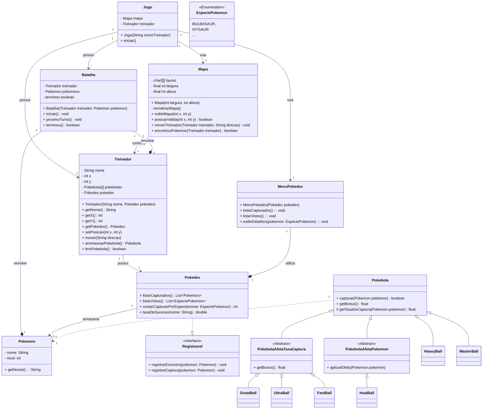

# Exercício: {{ page.title }}

## Objetivo

O objetivo deste exercício é praticar o uso de classes abstratas, métodos abstratos e polimorfismo, além de aplicar conceitos de herança e encapsulamento. 
Para isso, você deverá implementar uma hierarquia de classes para diferentes tipos de Pokébolas, cada uma com suas características específicas.

## Descrição

Você foi contratado para aprimorar o sistema do jogo Pokémon e deve implementar uma funcionalidade central: a **Pokedex**. 

A **Pokedex** é responsável por registrar informações sobre todos os Pokémon encontrados e capturados por um treinador durante suas aventuras.

Além disso, o sistema já conta com as classes **Treinador, Pokemon, Batalha e a interface Encontrável e Capturável**. 

Sua tarefa é implementar a classe Pokedex utilizando diferentes Collections e integrá-la ao sistema, garantindo que os registros sejam atualizados com base nos eventos das batalhas.

### Requisitos Funcionais

#### 1. Implementar a Classe **Pokedex**

Para implementar a classe **Pokedex** será necessário fazer o uso da **interface Registravel**.

- Funcionalidades:
  - Armazenar Pokémon capturados
  - Armazenar Pokémon vistos (mas não capturados)
  - Contabilizar capturas por espécies
  
- Métodos
  - `void registrarEncontro(Pokemon pokemon)`
     - Registra um encontro com o Pokémon o adicionando  na lista de pokemons vistos. 
  - `void registrarCaptura(Pokemon pokemon)`
     - Registra a captura de um pokemon. 
  - `List<Pokemon> listarCapturados() `
      - Retorna uma lista de Pokémon capturados, ordenada pelo número da espécie.
  - `List<Pokemon> listarVistos()`
      - Retorna uma lista de Pokémon vistos, ordenada pelo número da espécie.
  - `int contarCapturasPorEspecie(String nome)`
     - Retorna o número de capturas de uma espécie específica.
  - `double taxaDeSucesso(String nome)`
      - Calcula a taxa de sucesso de captura de uma espécie, considerando o número de capturas em relação ao número de encontros.
    
#### 2. Integrar a Pokedex ao Sistema

Modifique a classe Batalha para que ela passe a atualizar pokedex do treinador. 

#### 3. Classe: MenuPokedex

Essa classe será responsável por gerenciar como o treinador interage com a Pokedex. Essa classe deve receber uma instância da Pokedex no construtor e usar os métodos da mesma para listar ou exibir detalhes.

Além disso, a cada interação, ela deve permitir que que o treinador visualize:

- Todos os Pokémon vistos.
- Todos os Pokémon capturados.
- Detalhes de um Pokémon específico
- Voltar ao mapa

Ela deve ler dados do teclado e reagir de acordo com a opção escolhida pelo usuário.

#### 4. Classe Treinador

Modifique o construtor da classe Treinador para incluir uma instância da Pokedex.
