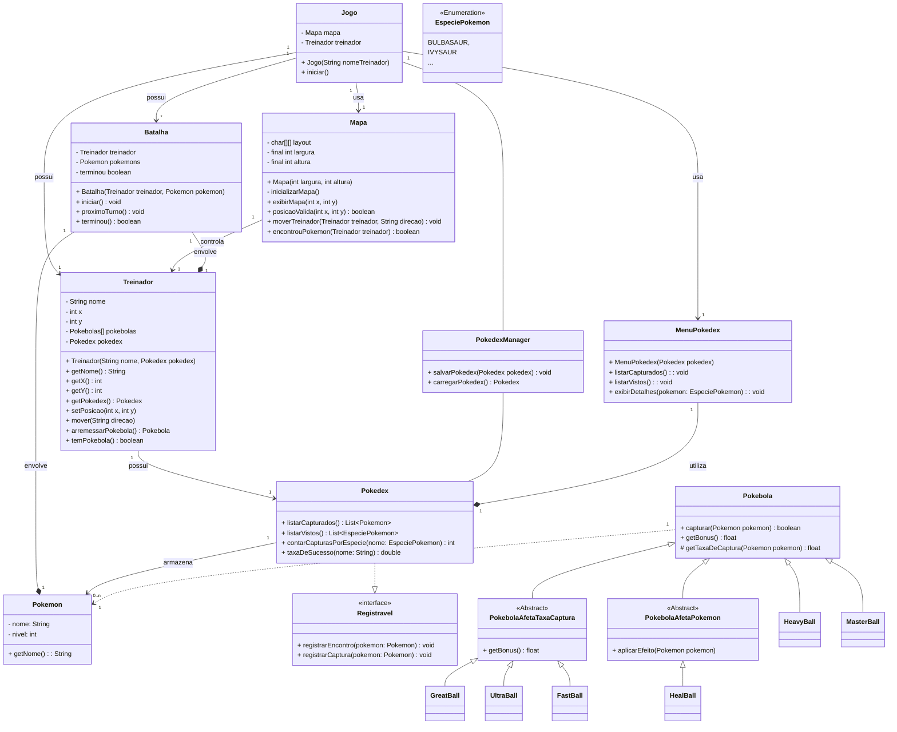

# Exercício: {{ page.title }}

## Objetivo

O objetivo deste exercício é praticar o uso de tratamento de exções e afim de:

- Implementar um sistema de persistência da Pokédex usando um arquivo CSV.
- Aplicar tratamento de exceções para garantir que o jogo funcione mesmo em caso de erros.

## Descrição

No jogo Pokémon que estamos desenvolvendo, o treinador captura Pokémon ao longo de sua jornada. Para que essas informações não sejam perdidas ao fechar o jogo, você deve implementar um sistema para salvar e carregar a Pokédex usando um arquivo.

Além disso, o sistema deve ser robusto, ou seja, deve lidar corretamente com possíveis erros que podem ocorrer durante a leitura e escrita do arquivo.

### Requisitos Funcionais

#### 1.Criar a classe **PokedexManager**

Esta classe será responsável por salvar e carregar a Pokédex a partir de um arquivo JSON.

- `void salvarPokedex(Pokedx pokedex)`
  - Deve converter a Pokekex para CSV e salvá-la em dois arquivos capturados.csv e vistos.csv
  - Se houver erro ao salvar, exibir uma mensagem amigável.

- `Pokedex carregarPokedex()`
  - Deve carregar a Pokedex a partir dos arquivos csv  - Se o arquivo não existir, retornar uma Pokédex vazia.
 - Se o arquivo estiver corrompido, exibir uma mensagem de erro e retornar uma Pokédex vazia.    

 
#### 2. Modificar a classe jogo

- Ao iniciar o jogo, a Pokedex deve ser carregada automaticamente
- Ao sair do jogo, a Pokedex deve ser salva imediatamente no arquivo